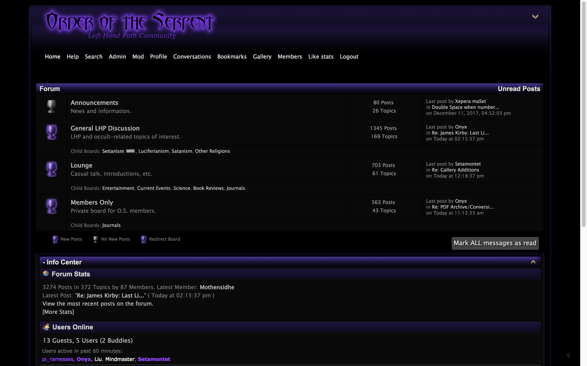

# Order of the Serpent (O.'.S.'.)

## Live Site
You can access the Order at http://www.orderoftheserpent.org/index.html

## Introduction
The Order's mission statement, which can be found in the statement.html, is as follows:

The Order of the Serpent is a modern Left-Hand Path organization. We are dedicated to the accumulation and sharing of knowledge and ideas in an open setting, especially knowledge and ideas which are related to the Left-Hand Path.

The Left-Hand Path is a school of thought which is founded on the individual self, rather than something outside of oneself. We believe that self-perfection at the individual level is not only the key to personal happiness and success, but the key to improving society and the human species over all. To meet this goal, those on the Left-Hand Path openly investigate what works for them or interests them, from practical everyday behavior such as language and presentation, to more ideological things such as different mythologies or moral values.

To aid in this journey, the Order of the Serpent has created an online forum for open discussion between those who walk the Left-Hand Path and those with a respectful interest in the Path. We also provide an ever-expanding library of books, movies, shows, and podcasts which relate to the Left-Hand Path. Finally, members of the Order compile The Imperishable Star, a newsletter which comes out several times a year and is freely available. These newsletters include members’ original essays on Left-Hand Path topics, custom rituals, and novel works of Left-Hand Path based fiction.

The Order encourages all of those who follow the Left-Hand Path, and all those who are interested, to join the forum, which is available to all. As for whether you should join the Order of the Serpent or not – we are simply looking for those who wish to provide Left-Hand Path knowledge to individuals who seek it, including the original works of our diverse and talented members.

The Path of Darkness leads to Enlightenment.
Like the Ancient Serpent, so too may You Endure.

## Use Case
Why is this app useful? Never before has the Left-Hand Path been publicly available for users at no cost. And there are no degrees of access to information. The Order is has moved up from #3 to #1 in SEO Google ranks in the States. 

## Technical
The app is built using SMF 2.0.15 and FreeBSD. Changes are also made with the MAMP stack before sFTPing it up to the remote site. The front-end is built using HTML5, CSS3, and JavaScript. Any other technical questions may be directed to TheDarkPath at our contact page, also found on the site.

